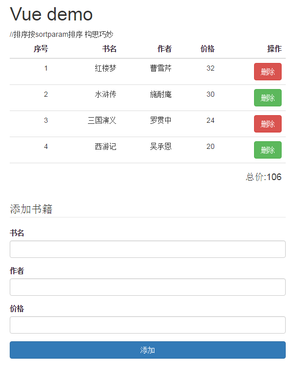

#学习VUE的demo

####示例

###原理说明
例子中使用了常用的v-for指令，通过操作数组数据实现增删改查操作。
另外排序部分，vueJS集成了一些方法可以快速实现排序：
    <tr v-for="book in books | orderBy sortparam">
sortparam在data中规定默认值，然后随着mothods中的sortBy方法传递的参数变化决定排序。

